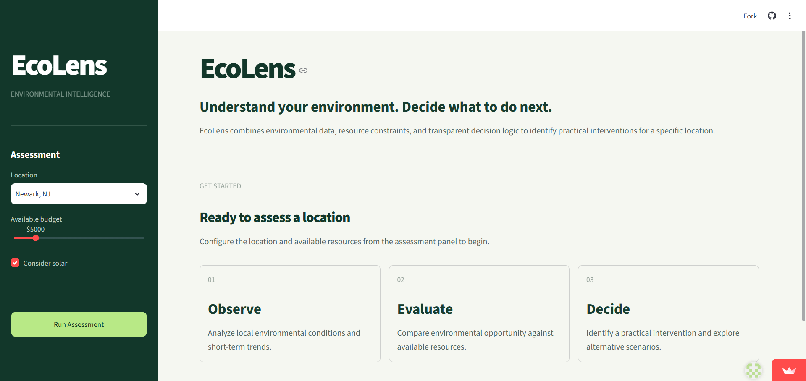
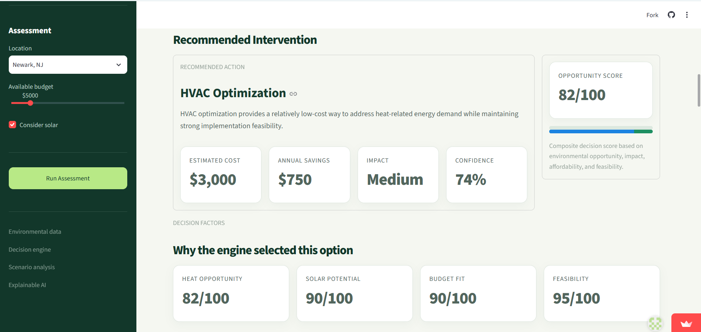
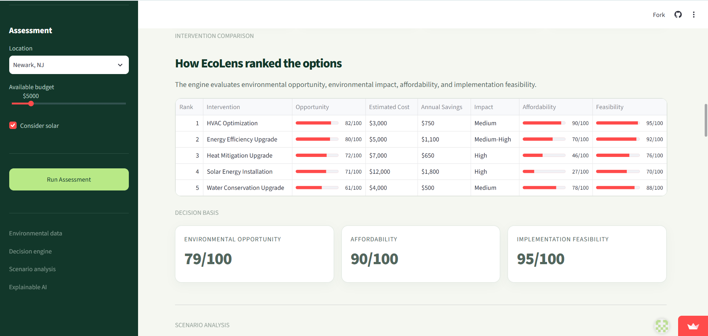
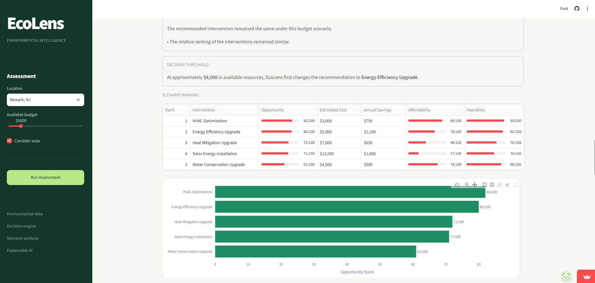
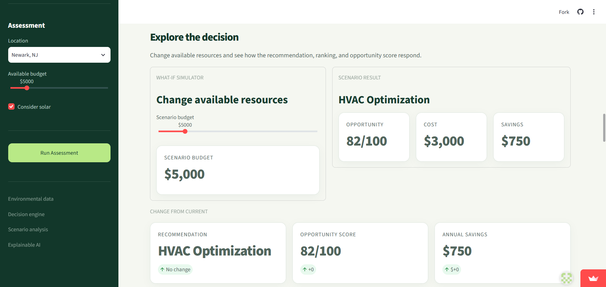
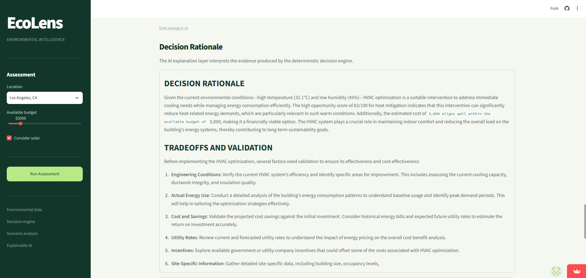
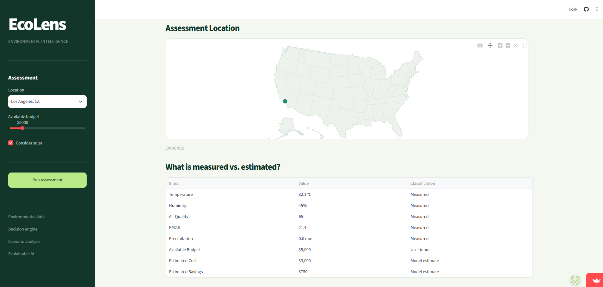

# EcoLens

### Environmental Decision Intelligence

[Live Demo](https://ecolens-decision.streamlit.app/)

EcoLens is a Python/Streamlit project that uses environmental data, a deterministic scoring system, and budget scenarios to recommend practical environmental interventions for a location.

## What It Does

You choose a location, set a budget, and choose whether to consider solar.

EcoLens then:

- Gets current environmental data and a short-term forecast
- Scores different interventions
- Ranks the available options
- Recommends the highest-scoring option
- Shows the estimated cost and savings
- Lets you change the budget and see what happens
- Shows the budget level where the recommendation changes
- Uses AI to explain the recommendation

## Main Features

### Environmental Data

The app displays:

- Temperature
- Humidity
- Air quality
- PM2.5
- Precipitation
- Temperature forecast

Environmental data comes from Open-Meteo.

### Decision Engine

The recommendation is **not generated by AI**.

I built a deterministic scoring system that compares interventions using:

- Environmental opportunity
- Environmental impact
- Affordability
- Implementation feasibility

Some of the interventions currently evaluated include:

- HVAC Optimization
- Energy Efficiency Upgrade
- Heat Mitigation Upgrade
- Solar Energy Installation
- Water Conservation Upgrade

### Scenario Analysis

The scenario section lets you change the available budget and see how the decision changes.

It compares:

- Recommendation
- Opportunity score
- Cost
- Annual savings
- Intervention ranking

It also identifies an approximate budget threshold where another intervention becomes the better option.

### Explainable AI

The AI layer is only used to explain the result from the decision engine.

The AI does not generate the environmental measurements or the underlying recommendation.

It explains:

- Why an intervention was selected
- Which factors affected the decision
- What tradeoffs exist
- What should be checked before actually implementing the recommendation

### Location & Evidence

The app includes a map of the selected location and an evidence section showing which values are measured data, user inputs, or model estimates.

---

## Screenshots

### Home



### Environmental Assessment



### Recommended Intervention



### Intervention Ranking



### Scenario Analysis



### Explainable AI



### Location & Evidence



---

## How It Works

```text
Environmental Data
        ↓
Decision Scoring
        ↓
Intervention Ranking
        ↓
Recommendation
        ↓
Scenario Analysis
        ↓
AI Explanation